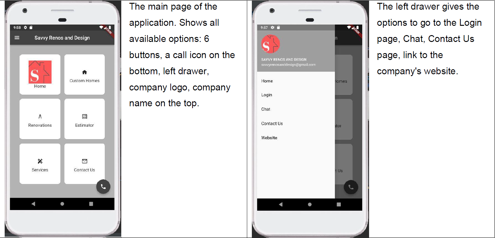
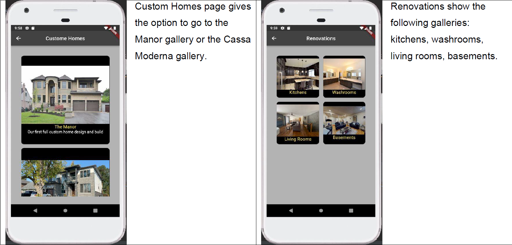
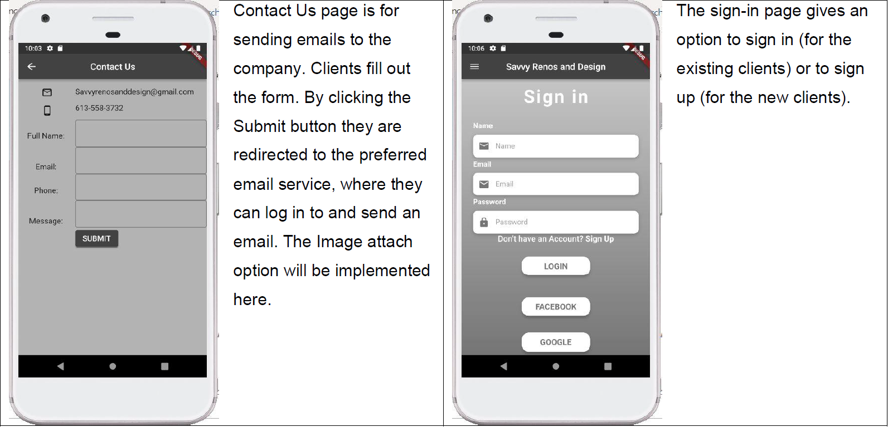

## 1.Introduction

The MACKX (Team 01) will be working on a project for Savvy Renos and Design, which is represented by business owner Preet Sandhu, during the Fall term of 2021. The goal of the project is to create an iOS/Android app that will be available on the Apple/Google App Store. Savvy Renos and Design is an Ottawa-based construction and remodelling firm that has been on the market since 2014. The company's owners have been creating a strong client base since the outset, managing projects from start to end and collaborating with a team that transforms the client's vision into reality.

## 2.About the app

